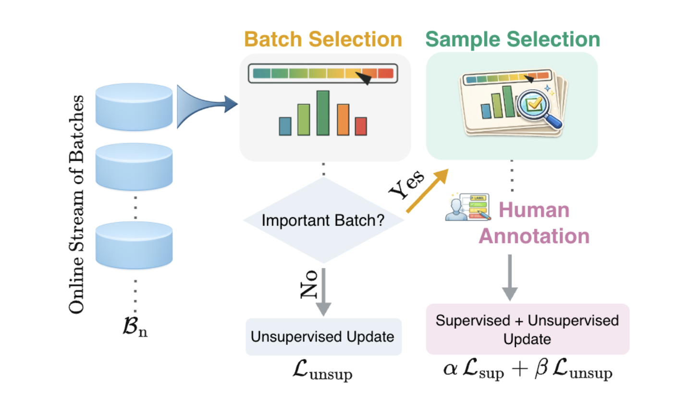

# WISE-ATTA

Official PyTorch implementation of  
**WISE-ATTA: When to Ask for Labels in Budgeted Active Test-Time Adaptation**

> Budget-aware active test-time adaptation for long test streams with limited supervision.

<p align="center">
  
</p>

---

## Table of Contents

- [Overview](#overview)
- [Highlights](#highlights)
- [Environment](#environment)
- [Datasets](#datasets)
- [Installation](#installation)
- [Usage](#usage)
- [Batch Selection Strategies](#batch-selection-strategies)
- [Results](#results)
- [Acknowledgements](#acknowledgements)
- [Contact](#contact)
- [Citation](#citation)

---

## Overview

**WISE-ATTA** studies a practical setting of **budgeted active test-time adaptation (ATTA)**, where labels are available for only a small fraction of test batches rather than every batch. The key question is not only **what to label**, but also **when to spend the labeling budget** over time.

To address this, WISE-ATTA introduces two complementary components:
- **Budget-paced batch selection**, which decides **when** to request supervision using lightweight online utility signals.
- **Drift-based sample selection**, which decides **what** to label by selecting a single informative sample based on prediction drift relative to an EMA anchor model.

---

## Highlights

- **Budgeted ATTA** for long test streams
- **Selective supervision over time** instead of labeling every batch
- **Single-sample querying** for selected batches
- No replay buffer required
- Evaluated on **ImageNet-C/R/K/A**

---

## Environment

Tested with:

- **Driver Version:** 550.163.01
- **CUDA Version:** 12.4
- **Python Version:** 3.10.12

---

## Datasets

We evaluate on the following benchmarks:

- **[ImageNet-C](https://zenodo.org/records/2235448#.Yj2RO_co_mF)**: Common corruptions
- **[ImageNet-R](https://github.com/hendrycks/imagenet-r)**: Renditions
- **[ImageNet-K / ImageNet-Sketch](https://github.com/HaohanWang/ImageNet-Sketch)**: Sketches
- **[ImageNet-A](https://github.com/hendrycks/natural-adv-examples)**: Adversarial examples

After downloading the datasets, update the dataset root in `classification/conf.py`:

```python
_C.DATA_DIR = "/your/dataset/path"
```

---

## Installation

1. Clone the repository:
   ```bash
   git clone https://github.com/Muhammad-Huzaifaa/WISE-ATTA.git
   cd wise-atta
   ```

2. Create the conda environment:
   ```bash
   conda update conda
   conda env create -f environment.yml
   conda activate wise-atta
   ```

---

## Usage

### Example Run on ImageNet-C

The following command runs WISE-ATTA on ImageNet-C using the default configuration:

```bash
cd classification
python test_time.py --cfg cfgs/imagenet_c/wiseatta.yaml MODEL.ADAPTATION wise
```

### Configuration

Modify parameters in the config files (e.g., `cfgs/imagenet_c/wiseatta.yaml`):

- `MODEL.ADAPTATION`: batch selection strategy (`wise`, `uniform`, or `random`)
- `MODEL.EDGE_ARCH`: backbone used for adaptation
- `MODEL.LABEL_RATIO`: Fraction of batches to label


---


## Results 

WISE-ATTA achieves competitive or better performance than prior ATTA methods while using fewer labels. In particular, with 1 label per batch, WISE-ATTA achieves the best average error across ImageNet-R/K/A, and remains competitive even at 0.5 labels per batch.

| #Labels | Method | ImageNet-R | ImageNet-K | ImageNet-A | Avg. Error |
|---|---|---:|---:|---:|---:|
| - | TENT | 57.8 | 69.5 | 99.9 | 75.7 |
| - | CoTTA | 57.3 | 69.9 | 99.8 | 75.7 |
| - | SAR | 57.2 | 68.5 | 99.9 | 75.2 |
| - | ETA | 54.0 | 64.3 | 99.8 | 72.7 |
| - | CEMA† | 51.4 | 65.6 | 97.7 | 71.6 |
| 3 | SimATTA | 51.3 | 64.0 | 97.2 | 70.8 |
| 3 | HILTTA | 52.6 | 63.3 | 98.3 | 71.4 |
| 1 | EATTA | 52.8 | 64.1 | 99.1 | 72.0 |
| 1 | **WISE-ATTA** | **51.2** | **63.8** | **97.7** | **70.9** |
| 0.5 | **WISE-ATTA** | 52.2 | 64.6 | 98.3 | 71.7 |


---

## Acknowledgements

This repository is built upon the excellent codebases:

- [EATTA](https://github.com/flash1803/EATTA/)
- [test-time-adaptation](https://github.com/mariodoebler/test-time-adaptation)

We also thank the authors of prior TTA and ATTA methods that inspired this work, including TENT, SimATTA, CEMA, HILTTA, and EATTA.

---

## Contact

For questions or collaborations, please contact:

Muhammad Huzaifa  
muhammad.huzaifa [at] cispa.de

---

## Citation

If you find this work useful, please cite:

```bibtex
@article{wiseatta2026,
  title={WISE-ATTA: When to Ask for Labels in Budgeted Active Test-Time Adaptation},
  author={...},
  journal={...},
  year={2025}
}
