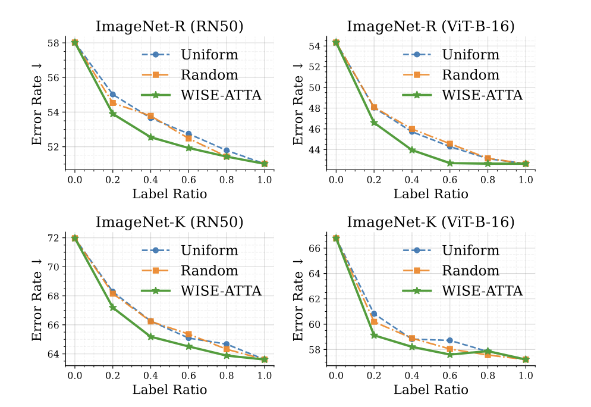

# WISE-ATTA

Official PyTorch implementation of  
**WISE-ATTA: When to Ask for Labels in Budgeted Active Test-Time Adaptation**

> Budget-aware active test-time adaptation for long test streams with limited supervision.

<p align="center">
  
</p>

---

## Table of Contents

- [Overview](#overview)
- [Highlights](#highlights)
- [Environment](#environment)
- [Datasets](#datasets)
- [Installation](#installation)
- [Usage](#usage)
- [Batch Selection Strategies](#batch-selection-strategies)
- [Results](#results)
- [Acknowledgements](#acknowledgements)
- [Contact](#contact)
- [Citation](#citation)

---

## Overview

**WISE-ATTA** studies a practical setting of **budgeted active test-time adaptation (ATTA)**, where labels are available for only a small fraction of test batches rather than every batch. The key question is not only **what to label**, but also **when to spend the labeling budget** over time.

To address this, WISE-ATTA introduces two complementary components:
- **Budget-paced batch selection**, which decides **when** to request supervision using lightweight online utility signals.
- **Drift-based sample selection**, which decides **what** to label by selecting a single informative sample based on prediction drift relative to an EMA anchor model.

---

## Highlights

- **Budgeted ATTA** for long test streams
- **Selective supervision over time** instead of labeling every batch
- **Single-sample querying** for selected batches
- No replay buffer required
- Evaluated on **ImageNet-C/R/K/A**

Across **ImageNet-C** and natural distribution shift benchmarks (**ImageNet-R**, **ImageNet-K**, and **ImageNet-A**), WISE-ATTA achieves competitive or improved robustness while using substantially fewer labels.

<p align="center">
  
</p>

---

## Environment

Tested with:

- **Driver Version:** 550.67
- **CUDA Version:** 12.4
- **Python Version:** 3.10.12

---

## Datasets

We evaluate on the following benchmarks:

- **[ImageNet-C](https://zenodo.org/records/2235448#.Yj2RO_co_mF)**: Common corruptions
- **[ImageNet-R](https://github.com/hendrycks/imagenet-r)**: Renditions
- **[ImageNet-K / ImageNet-Sketch](https://github.com/HaohanWang/ImageNet-Sketch)**: Sketches
- **[ImageNet-A](https://github.com/hendrycks/natural-adv-examples)**: Adversarial examples

After downloading the datasets, update the dataset root in `classification/conf.py`:

```python
_C.DATA_DIR = "/your/dataset/path"
```

---

## Installation

1. Clone the repository:
   ```bash
   git clone https://github.com/your-repo/wise-atta.git
   cd wise-atta
   ```

2. Create the conda environment:
   ```bash
   conda update conda
   conda env create -f environment.yml
   conda activate wise-atta
   ```

---

## Usage

### Example Run on ImageNet-C

```bash
cd classification
python test_time.py --cfg cfgs/imagenet_c/wiseatta.yaml MODEL.ADAPTATION wise
```

### Configuration

Modify parameters in the config files (e.g., `cfgs/imagenet_c/wiseatta.yaml`):

- `MODEL.ADAPTATION`: Choose the adaptation method
- `MODEL.ORACLE_NUM`: Number of samples to label per batch
- `MODEL.LABEL_RATIO`: Fraction of batches to label
- Other hyperparameters as needed

---

## Batch Selection Strategies

You can replace `wise` in `MODEL.ADAPTATION` with:

- `wise` — WISE-ATTA batch selection (utility-based)
- `uniform` — Uniform batch selection
- `random` — Random batch selection

---

## Results

[Add results section here, e.g., tables or figures showing performance on different datasets and label ratios.]

---

## Acknowledgements

This repository is built upon the excellent codebases:

- [EATTA](https://github.com/mohammad-amin-gheisari/EATTA)
- [test-time-adaptation](https://github.com/mariodoebler/test-time-adaptation)

We also thank the authors of prior TTA and ATTA methods that inspired this work, including TENT, SimATTA, CEMA, HILTTA, and EATTA.

---

## Contact

For questions or collaborations, please contact:

Muhammad Huzaifa  
muhammad.huzaifa [at] cispa.de

---

## Citation

If you find this work useful, please cite:

```bibtex
@inproceedings{your-paper,
  title={WISE-ATTA: When to Ask for Labels in Budgeted Active Test-Time Adaptation},
  author={Your Name et al.},
  booktitle={Conference},
  year={2024}
}
```
